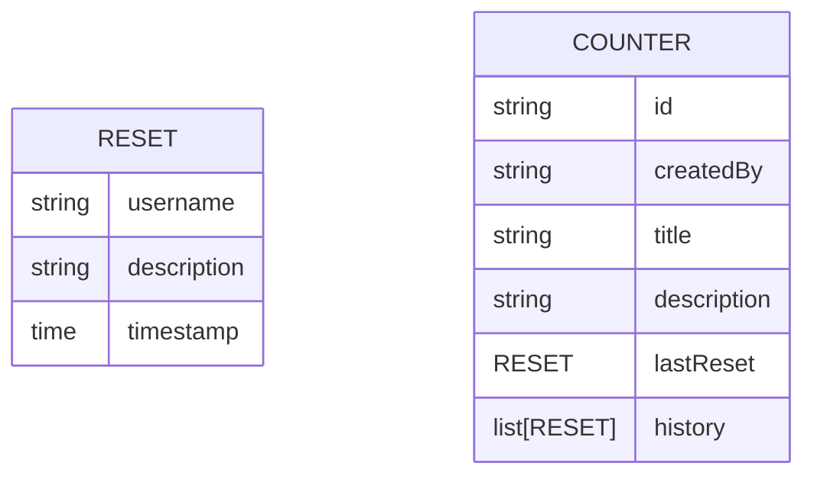

# counters
Days Since Last Useless House Service was Mode: 0 

```mermaid
erDiagram

    RESET {
        string username
        string description
        time timestamp
    }
    COUNTER {
        string id
        string createdBy
        string title
        string description
        RESET lastReset
        list[RESET] history
    }

```

__TODO__

[] Load History

[] Allow adding a reset

[] Implement csh-auth

[] Make Sections Smaller in Width

